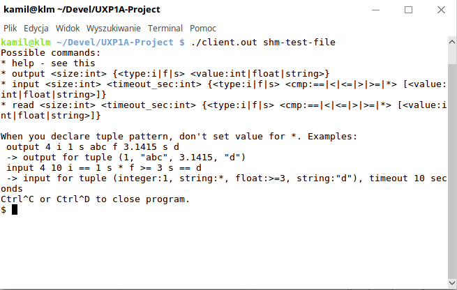

## 6. Szczegółowy opis interfejsu użytkownika

Testowy interfejs użytkownika dostarczany jest przez aplikację wykorzystującą
przygotowaną bibliotekę `Linda` w formie prostej konsoli, w której użytkownik
może wykonywać poszczególne operacje wpisując odpowiednie komendy.

### Kompilacja i uruchomienie

Aby skompilować program, należy w katalogu głównym repozytorium wykonać:

    cmake CMakeList.txt
    make

W ten sposób skompilowany zostanie program wynikowy `client.out` zawierający
klienta oraz pliki testów automatycznych, które można wywołać poleceniem `make test`.

Aby uruchomić klienta, należy podać mu jako parametr ścieżkę do pliku, który
zostanie użyty do wygenerowania klucza dla systemowych wywołań. Plik ten musi
istnieć i być dostępny. Przykładowo:

    ./client.out shm-test-file

Uruchomienie wielu instancji klienta z tą samą ścieżką powoduje utworzenie systemu,
w którym mogą się one komunikować. Wyłaczenie klienta następuje sekwencją klawiszy
`Ctrl` + `C` lub `Ctrl` + `D`.

### Obsługa klienta

_Rys. 1. Klient po uruchomieniu_

Klient dostarcza interaktywnej sesji obsługującej kilka komend:
* **help** - wyświetla pomoc z przykładami użycia
* **output** - realizuje operację _output_
* **input** - realizuje oprację _input_
* **read** - realizuje operację _read_

Składnia dla polecenia **output** jest następująca:

    output <size:int> {<type:i|f|s> <value:int|float|string>}

Pierwszy argument to rozmiar krotki, potem następuje ciąg definicji jej poszczególnych
elementów w postaci par litery określającej typ oraz wartości. Przykładowo
`4 i 2 f 3.5 s alfa i 23` oznacza krotkę o czterech elementach i postaci
`(2, 3.5, "alfa", 23)`.

Dla poleceń **input** oraz **read** składnia zawiera dodatkowo timeout i sposób
porównywania:

    input <size:int> <timeout_sec:int> {<type:i|f|s> <cmp:==|<|<=|>|>=|*> [<value:int|float|string>]}
    read <size:int> <timeout_sec:int> {<type:i|f|s> <cmp:==|<|<=|>|>=|*> [<value:int|float|string>]}

Pierwszy parametr to rozmiar krotki, następnie timeout podany w sekundach, potem
umieszczony jest ciąg odpowiednich wzorców elementów, w postaci trójek: litery
określającej typ, symbolu porównania, wartości do porównania (tylko gdy sposób
porównania jest różny od `*`).

| przykład                        | timeout | rozmiar krotki | wzorzec krotki                                 |
| ------------------------------- | ------- | -------------- | ---------------------------------------------- |
| `4 10 i == 1 s * f >= 3 s == d` | 10 sek. | 4 elementy     | `(integer:1, string:*, float:>=3, string:"d")` |
| `2 5 f > 2 s < d`               | 5 sek.  | 2 elementy     | `(float:>2, string:<"d")`                      |

Oznaczenia typów w składni:

| symbol | typ     |
| ------ | ------- |
| i      | integer |
| f      | float   |
| s      | string  |

Klient narzuca dodatkowe ograniczenie na **string** ze względu na sposób odczytu
ze standardowego wejścia - nie może on zawierać białych znaków (takiego 
ograniczenia nie ma wprost w bibliotece).

Oczekiwanie na wprowadzenie danych od użytkownika sygnalizowane jest znakiem
`$`. W przeciwnym wypadku, klient poprzedza wiadomości znakiem `>`  lub `#`
(w przypadku komunikatu o błędzie).

W przypadku wystąpienia błędów, klient może zasygnalizować błąd komunikatem,
do którego mogą być również dodane dodatkowe informacje:

* _Unknown command. See 'help'_
* _Invalid execute:..._
* _Invalid type_ 
* _Invalid condition_
* _Invalid tuple_
* _Timeout expired._ (nie znaleziono odpowiedniej ktorki w zadanym czasie)

W przeciwnym razie system zwraca reprezentację krotki, np: 

    > Found: (2, "abc")

